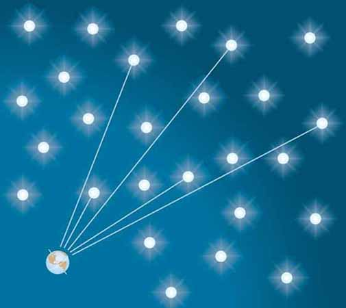
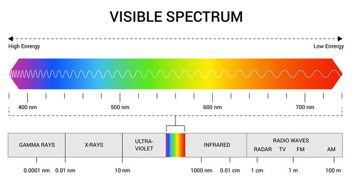

In the 19th century, many scientists at the time posed a rather simple question: why is the night sky dark? While today this paradox can be answered with our updated model of the universe, scientists at the time lacked evidence and certainty to choose from their handful of possible solutions. 

At the time, many scientists believed in a universe that's static and infinite in space and time. This meant that there was an infinite amount of stars extending out forever. Because they assumed the universe to have an infinite age, that meant starlight regardless of their distance should be able to reach Earth. So Olber reasoned (although others before him addressed this problem too) that if there were infinite stars in our infinitely aged universe, shouldn't the night sky be actually extremely bright?

Simply put, in an infinite universe, every line of sight should eventually hit some star light. And because there's infinite time, our night sky should actually be lit ablaze. 

Today with our modern model for the universe, the solution for this Paradox can be answered with two reasons. First, we have proved our universe has a finite age (13.7 billion years) and had a beginning. This means that the light from distant stars have not reached Earth yet. 

But this means technically, given enough time our night sky should be bright when enough starlight reaches us. But this proves to be false, because we also have proved our universe is expanding which causes a redshift in light. The result is visible light shifts to longer wavelengths and thus makes it invisible to the naked eye.

